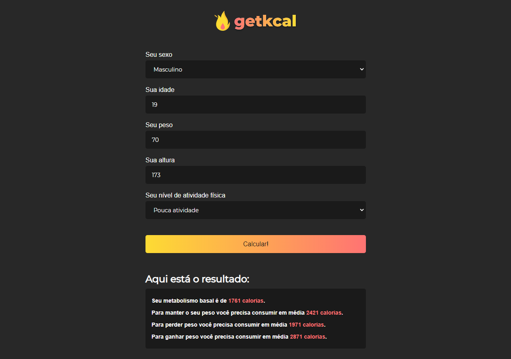

<h1 align="center">
<br>
  
<br>
</h1>

<p align="center">This project aims to calculate the basal metabolic rate through data sent by the user, using calculations to provide feedback with information on weight gain, or weight loss.</p>


<div align="center" >
  

</div>


<br>

---


## 🚀 Technologies

The project was developed with these technologies:

- ✔️ JavaScript

- ✔️ HTML

- ✔️ CSS

- ✔️ Serve


---

## ⚙ How To Use

```sh
This project does not need any impedance to work.
Feel free if you want to run this project directly in your browser directly with the file 'index.html' or use an extension like Live Server.
```


<br>

Made with 💜 by Rodrigo Alves 👋 [See my Linkedin](https://www.linkedin.com/in/rodrigo-alves-dev/)
<br>

